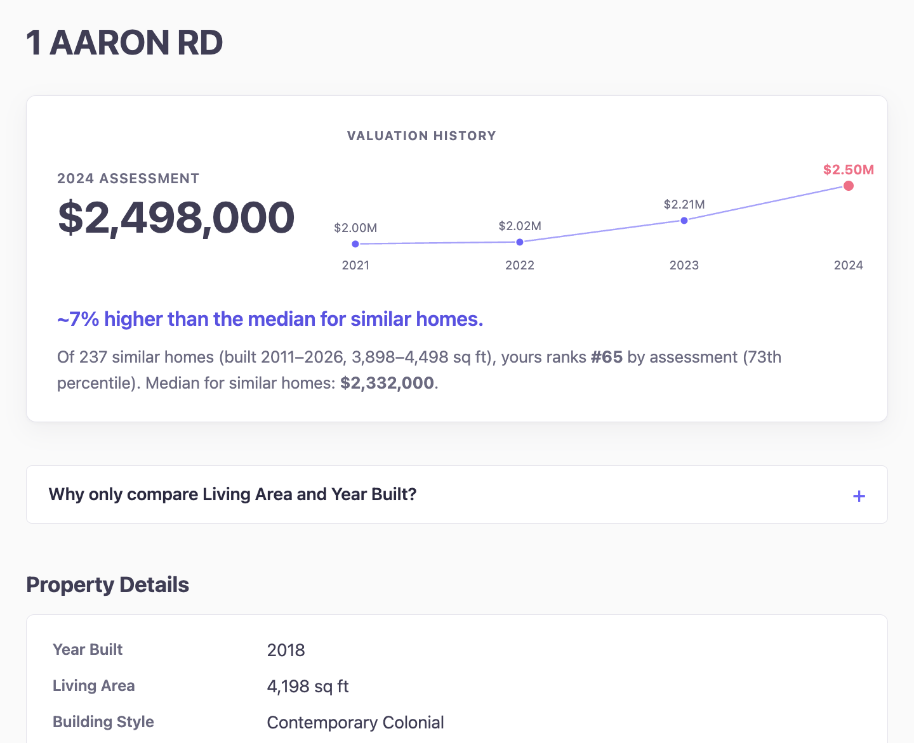

# Lexington Property Assessment Tool and Zoning Amendment Analysis

### Use my home comparison tool [here!](https://lexington-property-analysis.onrender.com/)

  
   
  <em>Screenshot from the site</em>

I scraped the data of over 12,000 properties from the Town of Lexington's [Public Assessor's Database](https://gis.vgsi.com/lexingtonma/), and used this data for two purposes:

1. Generate a report for any resident that provides analysis for how their property's assessment compares to other properties.

2. Analyze the impact of a 2023 [zoning amendment](https://www.lexingtonma.gov/DocumentCenter/View/8696/Article-34-Motion-combined?bidId=) to the assessed values of affected properties. [Read my analysis here](zoning_analysis/Results/Zoning_Analysis_Findings.pdf).

## Why I built this project

Living in Lexington, I noticed our property tax increased significantly from 2023 to 2024, despite no changes to our house. I wanted to determine if this was part of a town-wide trend or unique to our property; if it was the latter, this data could help us file an abatement and possibly reduce our taxes. I later realized I could extend this tool to be helpful for any Lexington resident.

I was also curious about the impact of zoning changes, such as that required by MA's 2023 law, to a property's value. [I wrote about my research and analysis here.](zoning_analysis/Results/Zoning_Analysis_Findings.pdf)

## What I learned

- Web scraping the town's database, collecting data on 35+ features per property. 
- How to implement multithreading to reduce the web scraping time from 2 hours to under 10 minutes. I also used a lock to make sure the program was thread-safe.
- Utilizing various graphs for data exploration. I created a correlation heatmap to isolate the features most correlated with a property's assessment, which helped me determine which kinds of properties to compare assessments with.
- Combining qualitiative research and statistics to answer a guiding question: What is the effect of zoning on a property's assessment?

## If I had more time, I would:

- Analyze how other factors affect a home's assessment, such as proximity to a school or plot size. A lot of older homes in Lexington are more valuable for their plot size, as they are often torn down, rather than valued for the house itself.
- Expand the zoning amendment analysis to include more towns. Many Massachusetts towns, not just Lexington, were required to add zoning for multi-family properties. I hypothesize that urban cities like Brookline and Medford would be more affected than residential communities like Lexington, since multifamily builders are more likely to profit off of that land.

## How to Use the Assessment Comparison Tool:
Visit [https://lexington-property-analysis.onrender.com/](https://lexington-property-analysis.onrender.com/).

I have deployed my site using Render's free tier, so it may take a few seconds to load.